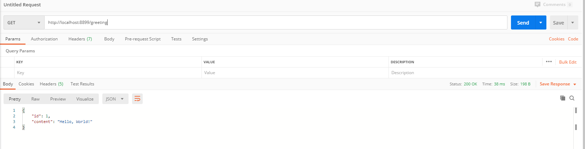
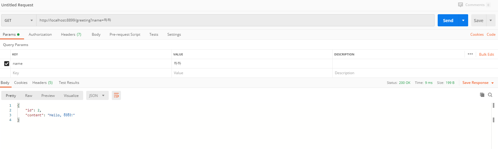

# SpringBoot를 활용하여 RESTful Web Service 기능을 구현하기
## Purpose
- 직접 뷰 템플릿을 사용하여 서버에서 HTML을 직접 만들고, 응답하기 보다, API에서 JSON 데이터를 실어서 반환하는 경우가 많아진 최근 웹 개발의 개발흐름에 따라,
@RestController를 통해, 서비스를 Restful하게 전달하는 방법을 익히고자 함.
- 앞으로 SpringBoot를 통해 REST API를 개발할 때, 테스트용으로 사용하기 위해 branch로 버전을 분리하고 테스트/비교를 하기 위해 만든 깃.

## Tutorial [https://spring.io/guides/gs/rest-service](https://spring.io/guides/gs/rest-service/)

- HTTP GET 방식으로 request 할 경우 다음과 같은 JSON 데이터가 출력 되어야 한다.
```
{"id":1,"content":"Hello, World!"}
```
- request 파라미터 명은 'name' 으로 할 것이고, name의 query string을 '하하'로 입력하면, 다음과 같은 JSON 데이터가 출력 되어야 한다.

```
{"id":1,"content":"Hello, 하하!"}
```

### 본 튜토리얼은 Gradle을 기반으로 프로젝트 관리를 할 것이다.
```
// build.gradle

dependencies {
	implementation 'org.springframework.boot:spring-boot-starter'
	implementation 'org.springframework.boot:spring-boot-starter-web'
	compileOnly 'org.projectlombok:lombok'
	annotationProcessor 'org.projectlombok:lombok'
	testImplementation('org.springframework.boot:spring-boot-starter-test') {
		exclude group: 'org.junit.vintage', module: 'junit-vintage-engine'
	}
}
```

### domain
```java
package com.restfulservice.demo.domain;

import lombok.Getter;

@Getter
public class Greeting {
    private final long id;
    private final String content;

    public Greeting(long id, String content) {
        this.id = id;
        this.content = content;
    }
}
```

### Resource Controller
- 본 튜토리얼 에서는 `GreetingController` 을 활용하여, 모든 HTTP request 들을 관리할 것이다.
- 기존 컨트롤러와 달리, domain 개체를 반환하는 컨트롤러임으로 @ResponseBody와 @Controller의 역할을 함께 수행해주는 @RestController 어노테이션을 추가해준다.
```java
package com.restfulservice.demo.controller;

import com.restfulservice.demo.domain.Greeting;
import org.springframework.web.bind.annotation.GetMapping;
import org.springframework.web.bind.annotation.RequestParam;
import org.springframework.web.bind.annotation.RestController;

import java.util.concurrent.atomic.AtomicLong;

@RestController
public class GreetingController {
    private static final String template = "Hello, %s!";
    private final AtomicLong counter = new AtomicLong();

    @GetMapping("/greeting")
    public Greeting greeting(@RequestParam(value = "name", defaultValue = "World") String name){
        return new Greeting(counter.incrementAndGet(), String.format(template, name));
    }
}
```

- `@GetMapping("/greeting")` : HTTP GET request - `http://localhost:8899/greeting` 에 해당하는 부분을 controller와 매핑해준다.
- `@RequestParam` : `?name=value` 에서 `value`의 내용을 입력/전달 해주는 파라미터 값과 매핑 해준다.
- Object -> JSON 으로 매핑하는 과정은 Spring's HTTP message Converter에서 지원해주는 `MappingJackson2HttpMessageConverter`
(Jackson Json 기반)으로 인해 따라 자동으로 처리된다.

### extra
```java
package com.restfulservice.demo;

import org.springframework.boot.SpringApplication;
import org.springframework.boot.autoconfigure.SpringBootApplication;

@SpringBootApplication
public class DemoApplication {

	public static void main(String[] args) {
		SpringApplication.run(DemoApplication.class, args);
	}

}
```

- `@SpringBootApplication`
    - `@Configuration` : beanfactory 역할을 해준다.
    - `@EnableAutoConfiguration` : bean 등록을 classpath 기준으로 자동 세팅해준다.
    - `@ComponentScan`  : base package(본 튜토리얼에서 `com.restfulservice.demo`)를 기준으로 @Component 애노테이션이 등록된 객체들을 빈으로 자동 등록,처리를 해준다.

### Test with Postman

- default value


- ?name=하하

